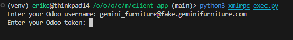
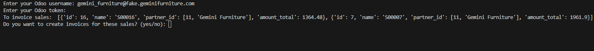
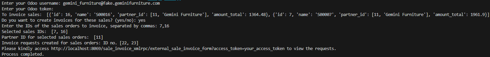

# custom-odoo17
This repository is to store Odoo 17 Custom Modules and docker configuration.

**Setup Odoo with Docker**
-
1. Clone this repository inside the custom or addons directory.
2. Clone the Odoo addons from https://github.com/odoo/odoo in addons directory.
3. Build the docker image using this command. `docker build -t odoo17-image .`
4. Make sure the image successfully generated by run this command. `docker image ls`
5. Access the odoo-docker directory and build the docker container using docker-compose file with this command. `docker-compose up -d`
6. Make sure the docker container is run by running this command. `docker-compose logs -f`

**Postman Config**
-
1. Import the `XMLRPC API.postman_collection.json`
2. Create a new environment to store the credentials data.
3. Test the connection using the `Authenticate` API.
4. Create the Invoice Request using the `Create Invoice Request` API.

**Postman Explanation**
-
1. Headers configuration to use key `Content-Type` with value of `text/xml`

Since the request will be done using xml payloads, then the Headers configuration should be adjusted for the xml text.

2. http://localhost:8069/xmlrpc/2/common

The `/xmlrpc/2/common` endpoint used to do authentication for user credentials. In this case, the payload parameters will be `database, login, token, {fields: < to be displayed >}. The output of the request will be the uid of the user.

3. http://localhost:8069/xmlrpc/2/object

The `/xmlrpc/2/object` endpoint used to interact with the database. In this case, the payload parameters depends on the method that will be called. More explanations on https://www.cybrosys.com/odoo/odoo-books/odoo-17-development/rpc/.

4. Body

The body to sent the request shall be written in raw xml format, for the formatting references on https://www.w3schools.com/xml/xml_syntax.asp.

**Endpoints**
- 
1. `/sale_invoice_xmlrpc/external_sale_invoice_form?access_token=`

This endpoint used to show the customers the list of their Invoice Requests. Customers can access the endpoint without login as long as adding the user's token to the endpoint.

2. `/sale_invoice_xmlrpc/external_sale_invoice_form/<int:id>#access_token=%s`

Customers can access this endpoint by clicking the Invoice data when they appeared after the invoice requests are approved. This will redirect the page into the reporting preview and the customers can download the reports.

**Client App**
1. While running the backend client app, we will receive this confirmation to input the user username and token. 

2. Then it will displays the user's "To Invoice" Sale Orders and ask confirmation if the user want to create invoices request from the sales. 

3. If user select the sales ids, it will generate the invoice request and automatically linked the sales with the invoice request data.

**Docker-compose file**
-
The docker-compose file contains configuration needed to run the Odoo service through docker container.
